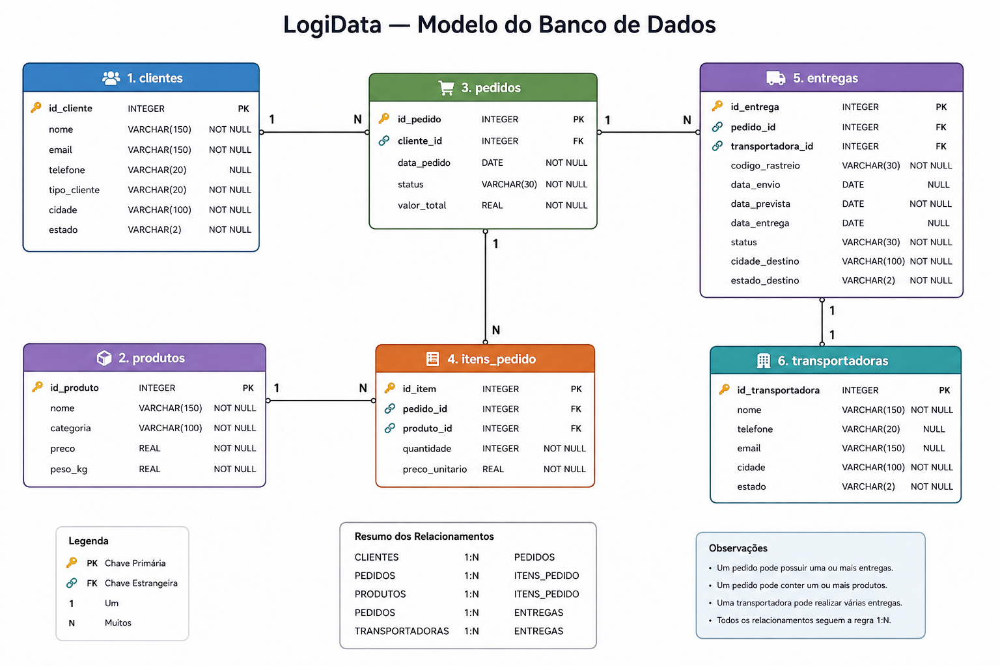

# LogiData — Sistema de Gestão Logística

## Sobre o projeto

O **LogiData** é um projeto de banco de dados relacional desenvolvido para representar o funcionamento de um sistema de gestão logística.

O projeto simula uma empresa responsável pelo gerenciamento de clientes, produtos, pedidos e entregas, além do acompanhamento das transportadoras responsáveis pela distribuição dos pedidos.

A solução utiliza **SQL e SQLite** para estruturar, armazenar, consultar e analisar os dados de uma operação logística.

O projeto foi desenvolvido como parte dos meus estudos em **Engenharia de Dados**, com o objetivo de aplicar na prática conceitos de bancos de dados relacionais, modelagem de dados e SQL em um cenário baseado em uma necessidade de negócio.

---

## Objetivo

O objetivo do LogiData é desenvolver uma estrutura de banco de dados capaz de representar uma operação logística e permitir a realização de consultas e análises sobre os dados gerados pela operação.

O projeto busca aplicar conceitos de:

- Modelagem de dados;
- Bancos de dados relacionais;
- SQL;
- SQLite;
- Estruturação de tabelas;
- Chaves e relacionamentos;
- Integridade dos dados;
- Manipulação de registros;
- Consultas;
- Análise de dados;
- Resolução de perguntas de negócio.

Para conhecer o contexto completo utilizado no projeto, consulte o [cenário da operação](docs/cenario.md).

---

## Documentação do projeto

A documentação foi organizada para separar cada aspecto do projeto e facilitar sua compreensão.

### Cenário

O [cenário do projeto](docs/cenario.md) apresenta o contexto da empresa fictícia, o funcionamento da operação logística e as entidades envolvidas.

### Regras de negócio

As [regras de negócio](docs/regras-negocio.md) definem as condições e regras que o sistema deve respeitar, incluindo os relacionamentos entre as entidades.

### Dicionário de dados

O [dicionário de dados](docs/dicionario-dados.md) apresenta detalhadamente as tabelas utilizadas no banco, seus campos, tipos de dados, chaves, restrições e relacionamentos.

### Perguntas de negócio

As [perguntas de negócio](docs/perguntas-negocio.md) apresentam as questões que irão orientar o desenvolvimento das consultas SQL e das análises do projeto.

---

## Modelo do banco de dados

O modelo visual representa a estrutura do banco de dados e os relacionamentos existentes entre suas tabelas.

O arquivo original do modelo também está disponível na pasta [docs](docs/).

---

## Estrutura do banco

O banco de dados é composto pelas seguintes entidades:

- `clientes`
- `produtos`
- `pedidos`
- `itens_pedido`
- `transportadoras`
- `entregas`

A descrição completa de cada tabela pode ser consultada no [dicionário de dados](docs/dicionario-dados.md).

---

## Dados

O projeto utiliza dados fictícios desenvolvidos especificamente para representar diferentes situações de uma operação logística.

A definição dos dados e dos cenários necessários para as consultas será baseada nas regras de negócio e nas perguntas definidas na documentação.

Os scripts responsáveis pela inserção dos dados estarão organizados em [sql/02_dados](sql/02_dados/).

O banco de dados SQLite será armazenado em [database](database/).

---

## Consultas SQL

As consultas SQL serão desenvolvidas para explorar os dados e responder às perguntas de negócio definidas para o projeto.

Os scripts de consulta estarão organizados em [sql/03_consultas](sql/03_consultas/).

As perguntas que orientam essas consultas estão disponíveis em [docs/perguntas-negocio.md](docs/perguntas-negocio.md).

---

## Análises

As análises serão desenvolvidas a partir dos resultados obtidos pelas consultas SQL.

Essa etapa terá como objetivo transformar os dados armazenados no banco em informações relevantes sobre a operação logística.

Os scripts relacionados às análises estarão organizados em [sql/04_analises](sql/04_analises/).

---

## Estruturação do banco

Os scripts responsáveis pela criação e estruturação das tabelas estarão organizados em [sql/01_estrutura](sql/01_estrutura/).

Essa etapa implementará a estrutura definida no [dicionário de dados](docs/dicionario-dados.md).

---

## Tecnologias utilizadas

- **SQL**
- **SQLite**

---

## Conceitos aplicados

Durante o desenvolvimento do projeto serão aplicados conceitos relacionados a:

- Bancos de dados relacionais;
- Modelagem de dados;
- Criação e alteração de tabelas;
- Tipos de dados;
- Chaves primárias;
- Chaves estrangeiras;
- Relacionamentos;
- Inserção e manipulação de dados;
- Consultas SQL;
- Filtros;
- Ordenação;
- Agrupamento;
- Funções de agregação;
- Funções de texto;
- Funções de data;
- Funções numéricas;
- Conversão de tipos;
- Expressões condicionais;
- Tratamento de valores nulos;
- Junções entre tabelas;
- Subconsultas;
- Views;
- Triggers.

---

## Estrutura do projeto

A organização do repositório foi definida para separar a documentação, o banco de dados e os scripts SQL.

    logidata/
    │
    ├── README.md
    │
    ├── docs/
    │   ├── cenario.md
    │   ├── regras-negocio.md
    │   ├── dicionario-dados.md
    │   ├── perguntas-negocio.md
    │   └── modelo-banco.png
    │
    ├── database/
    │   └── logidata.db
    │
    └── sql/
        ├── README.md
        │
        ├── 01_estrutura/
        │
        ├── 02_dados/
        │
        ├── 03_consultas/
        │
        └── 04_analises/

---

## Organização das pastas

### `docs/`

A pasta [docs](docs/) contém a documentação responsável por explicar o contexto, as regras, a modelagem e as perguntas que orientam o projeto.

### `database/`

A pasta [database](database/) contém o banco de dados SQLite utilizado pelo projeto.

### `sql/`

A pasta [sql](sql/) contém os scripts SQL utilizados durante o desenvolvimento.

A organização interna dessa pasta está documentada no [README da pasta SQL](sql/README.md).

### `sql/01_estrutura/`

A pasta [sql/01_estrutura](sql/01_estrutura/) contém os scripts relacionados à criação e estruturação do banco.

### `sql/02_dados/`

A pasta [sql/02_dados](sql/02_dados/) contém os scripts relacionados à inserção e manipulação dos dados.

### `sql/03_consultas/`

A pasta [sql/03_consultas](sql/03_consultas/) contém os scripts utilizados para realizar consultas e responder às perguntas de negócio.

### `sql/04_analises/`

A pasta [sql/04_analises](sql/04_analises/) contém os scripts utilizados para desenvolver análises a partir dos dados obtidos pelas consultas.

---

## Fluxo de desenvolvimento

O projeto segue uma sequência lógica de desenvolvimento:

    Cenário
       ↓
    Regras de negócio
       ↓
    Dicionário de dados
       ↓
    Perguntas de negócio
       ↓
    Modelo do banco
       ↓
    Estruturação do banco
       ↓
    Inserção dos dados
       ↓
    Consultas SQL
       ↓
    Análises

Cada etapa é desenvolvida com base nas definições estabelecidas nas etapas anteriores.

---

## Documentação rápida

| Documento | Descrição |
|---|---|
| [Cenário](docs/cenario.md) | Contexto e funcionamento da operação logística |
| [Regras de negócio](docs/regras-negocio.md) | Regras utilizadas pelo sistema |
| [Dicionário de dados](docs/dicionario-dados.md) | Estrutura detalhada das tabelas |
| [Perguntas de negócio](docs/perguntas-negocio.md) | Perguntas que orientam as consultas |
| [Modelo do banco](docs/modelo-banco.png) | Representação visual do banco |
| [Organização SQL](sql/README.md) | Organização dos scripts SQL |

---

## Status do projeto

**Em desenvolvimento.**

O projeto será desenvolvido progressivamente, passando pelas etapas de documentação, modelagem, criação do banco, inserção dos dados, desenvolvimento das consultas e realização das análises.

---

## Sobre

Este projeto foi desenvolvido como parte da minha formação em **Engenharia de Dados**, com foco no desenvolvimento de habilidades práticas em **SQL, SQLite e bancos de dados relacionais**.

A proposta é representar um cenário de negócio, estruturar seus dados e utilizar SQL para consultar e analisar informações relacionadas a uma operação de gestão logística.